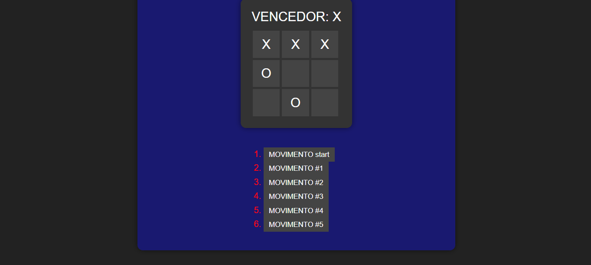

# JOGO DA VELHA COM REACT
☑️JOGO EM HTML/CSS/JS/REACT.

 <br> 

## DESCRIÇÃO:
Este é um jogo da velha implementado em React. O objetivo do jogo é conseguir três símbolos iguais (X ou O) em linha, coluna ou diagonal.

## COMO USAR?
### 1. Instalando as dependências:
Execute o seguinte comando no terminal para instalar as dependências necessárias (No diretório `codigo`):
```bash
npm install
```

### 2. Iniciando o servidor:
Após a instalação das dependências, inicie o servidor com o comando (No diretório `codigo`):
```bash
npm start
```

### 3. Acessando o site:
Abra o navegador de sua preferência e acesse o seguinte endereço:
```
http://localhost:5173/
```

Isso abrirá o jogo da velha em seu navegador, onde você poderá começar a jogar imediatamente.

### 4. Jogue:
1. Cada jogador (X e O) faz um movimento clicando em uma das células vazias no tabuleiro.
2. O jogo alterna entre os jogadores após cada movimento.
3. O jogo informará se houver um vencedor. Quando alguém vencer, o jogo para.
4. Para visualizar os movimentos anteriores, você pode clicar nos botões na lista de histórico.

## NÃO SABE?
- Entendemos que para manipular arquivos em `HTML`, `CSS` e outras linguagens relacionadas, é necessário possuir conhecimento nessas áreas. Para auxiliar nesse aprendizado, oferecemos cursos gratuitos disponíveis:
* [CURSO DE HTML E CSS](https://github.com/VILHALVA/CURSO-DE-HTML-E-CSS)
* [CURSO DE JAVASCRIPT](https://github.com/VILHALVA/CURSO-DE-JAVASCRIPT)
* [CURSO DE REACT](https://github.com/VILHALVA/CURSO-DE-REACT)
* [CONFIRA MAIS CURSOS](https://github.com/VILHALVA?tab=repositories&q=+topic:CURSO)

## CREDITOS:
- [PROJETO CRIADO PELA DOCUMENTAÇÃO OFICIAL DO REACT](https://react.dev/learn/tutorial-tic-tac-toe)
- [PROJETO APRIMORADO PELO VILHALVA](https://github.com/VILHALVA)
